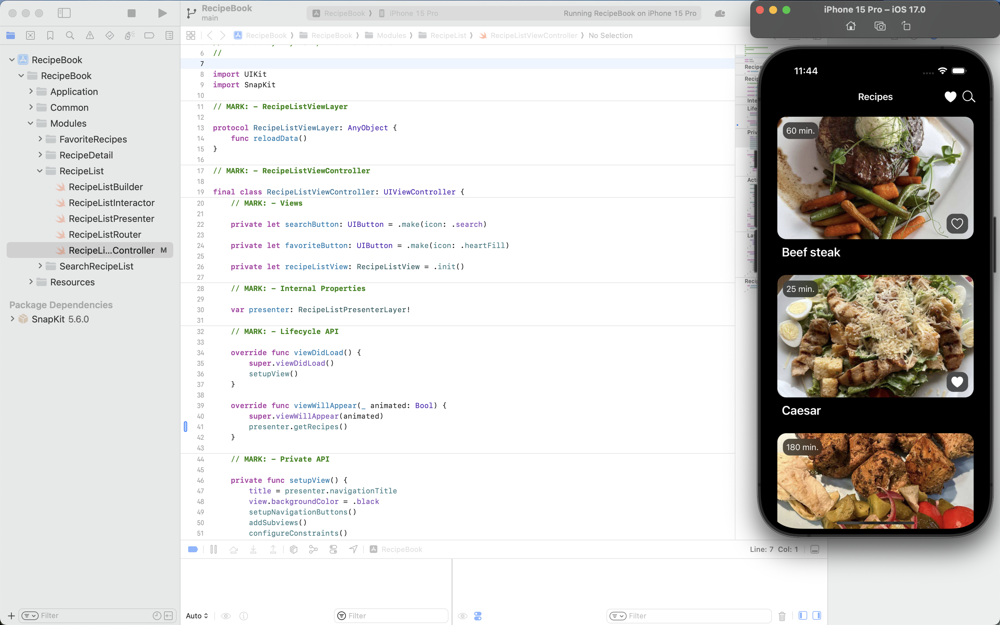

# Recipe Book App

## Overview

The Recipe Book App is a sample iOS application designed to showcase the VIPER architecture.                                                                                                       
VIPER is a modular architecture pattern that divides the screen into separate components, each with a specific responsibility.                                                                    
By enforcing clear boundaries between these components, VIPER promotes code organization, reusability, and testability                                                                              
This project demonstrates the implementation of VIPER with a simple recipe book application.

## Third-party dependencies

- **SnapKit:** Used for defining Auto Layout constraints in a programmatic way. For more detail you can check [SnapKit documentation](https://snapkit.github.io/SnapKit/docs/)

## Getting Started

To get started with the Recipe Book App, follow these steps:

1. Clone the repository to your local machine

2. Open the **RecipeBook.xcodeproj** file

3. Wait for **Swift Package Manager** to fetch **SnapKit** and resolve package graph 

4. Build and run the app using the iOS Simulator or a physical iOS device.

### Features

- **Recipe List:** Display a list of all recipes.
- **Recipe Search:** Display a list with a search bar where the user can search for desired recipes.
- **Favorite Recipes:** Display a list of favorite recipes.
- **Recipe Detail:** Display detailed information about the selected recipe.

## Architecture

The app follows the VIPER architecture pattern, which stands for:

- **View:** Represents the user interface elements and is responsible for displaying data to the user and capturing user input.
- **Interactor:** Contains the business logic and data processing algorithms. It interacts with entities to fetch and manipulate data, and performs operations based on the user’s actions received from the presenter.
- **Presenter:** Serves as the intermediary between the view and the interactor. It receives input from the view, processes it through the interactor, and formats the output to be displayed by the view. The presenter also handles user interactions and updates the view accordingly. if a user action requires navigation changes, the presenter will tell the router to perform the navigation task
- **Entity:** Represents the data model of the module, including entities such as managers, services, data objects, and network response models. It encapsulates the data used by the interactor and presenter, providing a structured representation of the application’s domain.
- **Router:** Manages navigation and transitions between screens.

## Design patterns

The app uses the following design patterns:

- **Static Factory Method:** is a creational design pattern that incapsulates the instantiation process. In the application context, it is used to create a VIPER module.
- **Delegation:** is a behavioral design pattern where one object, known as the delegator, assigns tasks or responsibilities to another object, known as the delegate. The delegator delegates specific tasks to the delegate, which then handles them according to predefined protocols. In the application context it is used for communication between VIPER layers and for customizing UITableView.

## Swift features

- **Concurrency:** The application takes advantage of Swift's concurrency features to handle asynchronous tasks efficiently. This includes the use of **async** & **await** keywords, **Task** and **@MainActor**. For more details you can check [Apple documentation](https://developer.apple.com/documentation/swift/concurrency)

## Development Environment

**Language**: Swift 5.9.2

**IDE**: Xcode  15.2.0

**Dependency Management:** Swift Package Manager

## Contributing

Contributions are welcome!

If you have any suggestions or bug report, feel free to create a pull request or open an issue.

## License

This project is licensed under the MIT License - see the [LICENSE](LICENSE) file for details.
